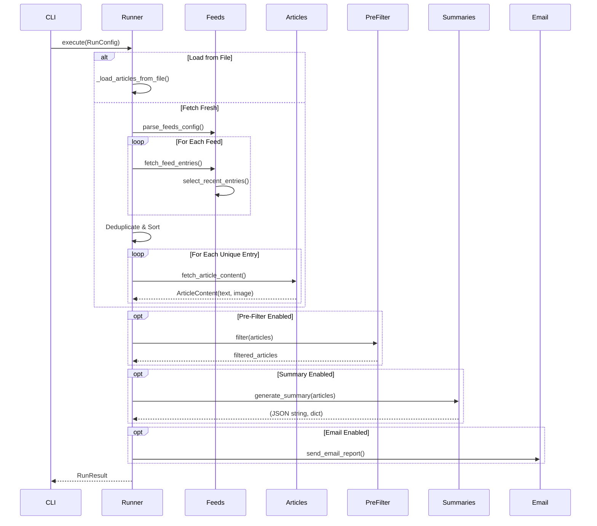
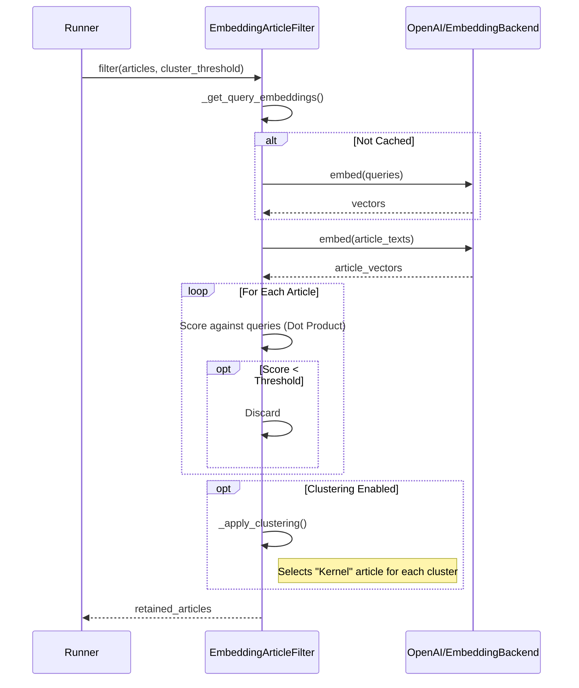
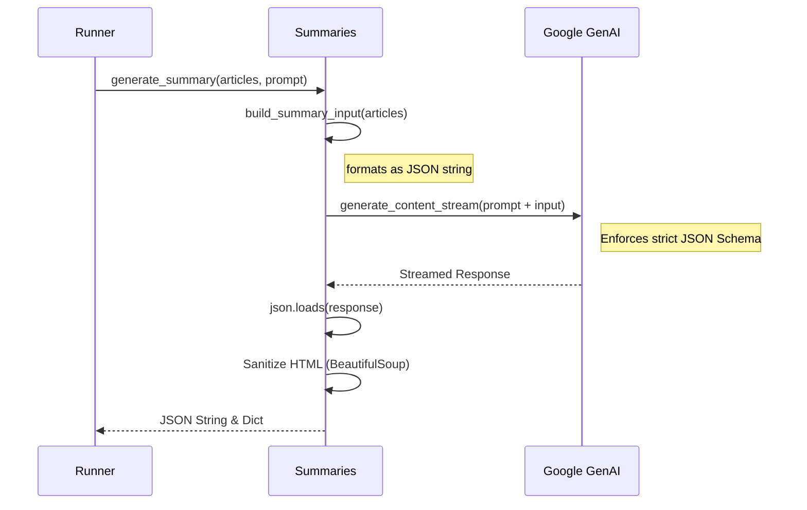

# Application Model: rss-morning

## 1. High-Level Architecture
**Pattern:** Modular Monolithic CLI with Cloud-Native Extensions.
**Style:** Pipeline / Orchestrator.
**Description:**
The application functions as a data processing pipeline inspired by the "Pipes and Filters" pattern, orchestrated by a central runner. It ingests RSS feeds, processes them through a series of optional filters (date, embeddings) and transformations (summarization), and outputs the result via Email or JSON. It uses a Hexagonal-ish architecture where core logic (`runner`, `prefilter`, `summaries`) is separated from adapters (`cli`, `emailing`, `feeds`, `articles`).

## 2. Service Map

| Module | Responsibility | Upstream | Downstream |
| :--- | :--- | :--- | :--- |
| **CLI** (`cli.py`, `main.py`) | Entry point, argument parsing, config loading, logging setup. | User (Terminal/Cron) | `Runner`, `Config` |
| **Config** (`config.py`) | Parses XML/Env configs, resolves secrets (Env/SSM), manages defaults. | `CLI`, `Runner` | AWS SSM |
| **Runner** (`runner.py`) | Orchestrates the entire pipeline: Fetch -> Filter -> Summarize -> Send. | `CLI` | `Feeds`, `Articles`, `PreFilter`, `Summaries`, `Email` |
| **Feeds** (`feeds.py`) | Parses OPML/RSS feeds, normalizes entries. | `Runner` | `feedparser` (Lib) |
| **Articles** (`articles.py`) | Fetches full article content, extracts text/image. | `Runner` | `newspaper3k` (Lib) |
| **PreFilter** (`prefilter.py`) | Filters articles using semantic embeddings and clustering. | `Runner` | `OpenAI` (API), `numpy` |
| **Summaries** (`summaries.py`) | Generates structured summaries using LLMs. | `Runner` | `Google Gemini` (API) |
| **Emailing** (`emailing.py`) | Renders templates and sends emails. | `Runner` | `Resend` (API), `Renderers` |
| **Renderers** (`renderers.py`) | Jinja2 template rendering for emails. | `Emailing` | `Templating` |

## 3. Detailed Data Models

### 3.1 Configuration Models (`config.py`)

#### `AppConfig` (Dataclass)
*   `feeds_file` (str): Path to OPML file.
*   `env_file` (Optional[str]): Path to env XML.
*   `limit` (int): Max articles per feed. Default `10`.
*   `max_age_hours` (Optional[float]): Cutoff for article age.
*   `summary` (bool): Enable summarization.
*   `pre_filter` (`PreFilterConfig`): Embedding filter settings.
*   `email` (`EmailConfig`): Email settings.
*   `secrets` (`SecretsConfig`): API keys.
*   `logging` (`LoggingConfig`): Log settings.
*   `prompt` (Optional[str]): System prompt for LLM.
*   `max_article_length` (int): Truncation limit. Default `5000`.

#### `PreFilterConfig`
*   `enabled` (bool): Default `False`.
*   `embeddings_path` (Optional[str]): Path to precomputed query embeddings.
*   `cluster_threshold` (float): Similarity threshold. Default `0.8`.

#### `SecretsConfig`
*   `openai_api_key` (Optional[str])
*   `google_api_key` (Optional[str])
*   `resend_api_key` (Optional[str])
*   `resend_from_email` (Optional[str])

### 3.2 Runtime Models (`runner.py` / `models.py`)

#### `RunConfig` (Dataclass)
*   **Purpose:** Flattens `AppConfig` and CLI args for execution.
*   Includes all `AppConfig` fields + `save_articles_path`, `load_articles_path`.

#### `FeedEntry` (Dataclass, `models.py`)
*   `link` (str)
*   `category` (str)
*   `title` (str)
*   `published` (datetime): Timezone-aware.
*   `summary` (Optional[str])

#### `ArticleContent` (Dataclass, `articles.py`)
*   `text` (Optional[str]): Cleaned article text.
*   `image` (Optional[str]): Top image URL.

#### `_ScoredArticle` (Inner Dataclass, `prefilter.py`)
*   `score` (float): Similarity score.
*   `article` (MutableMapping): The article data.
*   `vector` (np.ndarray): Embedding vector.

## 4. Logic & Flow (Sequence Diagrams)

### 4.1 Critical Flow: Main Pipeline (`runner.execute`)



### 4.2 Critical Flow: Embedding Filter (`prefilter.filter`)



### 4.3 Critical Flow: Summarization (`summaries.generate_summary`)



## 5. API/Interface Contract

### 5.1 CLI Arguments
| Argument | Default | Description |
| :--- | :--- | :--- |
| `--config` | `configs/config.xml` | Path to main config XML. |
| `--log-level` | `None` | Overrides logging level (DEBUG, INFO, etc.). |
| `--log-file` | `None` | Overrides log file path. |
| `--save-articles`| `None` | Path to dump intermediate JSON. |
| `--load-articles`| `None` | Path to load JSON (skip fetch). |

### 5.2 Environment Variables (Inputs)
| Variable | Required? | Purpose |
| :--- | :--- | :--- |
| `OPENAI_API_KEY` | Conditional | For `prefilter` (Embeddings). |
| `GOOGLE_API_KEY` | Conditional | For `summaries` (Gemini). |
| `GEMINI_API_KEY` | Conditional | Fallback for Google Key. |
| `RESEND_API_KEY` | Conditional | For `emailing` (Resend). |
| `RESEND_FROM_EMAIL`| Conditional | Sender email address. |
| `RSS_MORNING_LOG_STDOUT`| No | If "1", logs to stdout (Cloud mode). |
| `RSS_MORNING_USE_SSM`| No | If "true", attempts to load secrets from AWS SSM. |

### 5.3 Output Schema (JSON)
When `summary` is enabled, the output JSON structure is:
```json
{
  "summaries": [
    {
      "url": "string",
      "category": "string",
      "summary": {
        "title": "string",
        "what": "string",
        "so-what": "string",
        "now-what": "string"
      },
      "image": "string (optional, backfilled)"
    }
  ]
}
```

## 6. Infrastructure Requirements

### 6.1 AWS Resources
*   **Systems Manager (SSM) Parameter Store:**
    *   Used if `RSS_MORNING_USE_SSM=true`.
    *   Prefix: `/rss-morning/`
    *   Keys: `OPENAI_API_KEY`, `GOOGLE_API_KEY`, `RESEND_API_KEY`, `RESEND_FROM_EMAIL`.
    *   Policy: `aws/ssm-policy.json`.
*   **ECS/Fargate (Implied):**
    *   Trust policy `aws/ecs-trust-policy.json`.
*   **S3 (Implied):**
    *   Policy `aws/s3-policy.json`. Likely used for storage/state by external processes or deployment artifacts, though not directly referenced in Python code for runtime logic.

### 6.2 External APIs
1.  **OpenAI API:** `text-embedding-3-small` model. Used for semantic filtering.
2.  **Google Gemini API:** `gemini-flash-latest` model. Used for summarization.
3.  **Resend API:** Transactional email service.

## 7. Edge Cases & Constraints

### 7.1 Constraints
*   **Max Article Length:** 5000 characters (Configurable). Truncated before embedding/summarizing.
*   **Feed Limit:** Defaults to 10 articles per feed.
*   **Embedding Schema:** Hardcoded to `text-embedding-3-small` in `_EmbeddingConfig` (article filtering), though `summary` uses Gemini.

### 7.2 Error Handling & Resilience
*   **Feed Parsing:** Individual feed failures are logged and skipped; does not halt the entire process.
*   **Article Fetching:**
    *   Timeout: 20 seconds.
    *   Failures return empty content (`None`) and are handled downstream.
    *   Truncation logic applied if text is too long.
*   **Summarization:**
    *   Fallback: If LLM fails, returns raw article JSON.
    *   Validation: Enforces JSON schema. If parsing fails, falls back.
*   **Pre-Filter:**
    *   Failure to embed/score returns *original* list (fail-open) to avoid data loss.
    *   Precomputed embeddings failure falls back to live embedding.
*   **Email:**
    *   Failure logs error but does not crash app.
