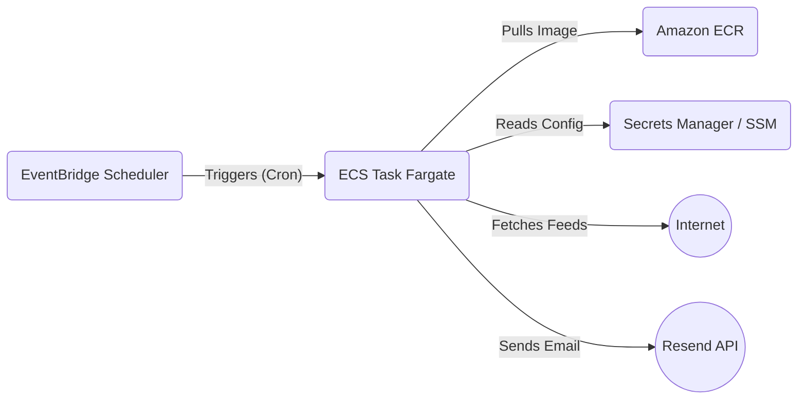

# AWS Deployment Guide for rss-morning

## Executive Summary
This document outlines the strategy to deploy `rss-morning` to Amazon Web Services (AWS).
Given the application's nature—a batch process that fetches RSS feeds, summarizes them, and emails a report—the recommended architecture is **AWS ECS Fargate (Run Task)** triggered by **Amazon EventBridge Scheduler**.

## 1. Required Application Changes
Before deployment, the following changes must be applied to the codebase to ensure security and observability.

### 1.1. Security: Create `.dockerignore`
**Critical**: The current repository lacks a `.dockerignore` file. Without it, the `COPY . .` command in the Dockerfile copies sensitive local files (like `configs/*.xml`, `venv`, or `.git` history) into the container.

**Action**: Create a `.dockerignore` file in the project root:
```text
.git
.gitignore
.dockerignore
venv/
__pycache__/
*.pyc
*.pyo
dist/
build/
*.egg-info/
logs/
configs/*.xml
!configs/*.xml.example
docker-compose.override.yml
query_embeddings.json
prefiltered.json
articles.json
mylog.txt
```

### 1.2. Security: Remove Secrets from Build Usage
**Critical**: The `Dockerfile` currently accepts `ARG OPENAI_API_KEY`. Passing secrets as build args persists them in the container layer history, which is a security vulnerability.
**Action**: Modify `Dockerfile`:
- Remove `ARG OPENAI_API_KEY`
- Remove the `RUN` block that executes `rss_morning.prefilter_cli`.
- Allow the application to generate embeddings at **runtime** (which it already supports if `query_embeddings.json` is missing).

### 1.3. Observability: Cloud-Friendly Logging
**Recommendation**: The application currently defaults to logging to a file in `main.py`. In dockerized environments, it is best practice to log to `stdout/stderr` so that AWS CloudWatch (via awslogs driver) can capture them.
**Action**: Modify `main.py` to detect if `config.logging.file` is untargeted or checks an environment variable (e.g., `RSS_MORNING_LOG_STDOUT=1`) to prevent adding the default FileHandler.

## 2. Architecture Overview



- **Amazon ECR**: Hosting the Docker container image.
- **AWS ECS (Fargate)**: Serverless compute to run the container. Zero maintenance of underlying servers.
- **EventBridge Scheduler**: Triggers the task every morning (e.g., 07:00 AM UTC).
- **Secrets Manager**: Safely stores `OPENAI_API_KEY` and `RESEND_API_KEY`.
- **Public Subnet**: The task will run in a public subnet to allow easy access to RSS feeds (outbound internet) and ECR.

## 3. Deployment Steps

### Step 1: Preparation
1.  Apply the changes listed in **Section 1**.
2.  Install AWS CLI and authenticate with your AWS account.

### Step 2: Create ECR Repository
Create a repository to store your application images.
```bash
aws ecr create-repository --repository-name rss-morning
```

### Step 3: Build and Push Image
Login to ECR and push your image.
```bash
# Login
aws ecr get-login-password --region <region> | docker login --username AWS --password-stdin <account_id>.dkr.ecr.<region>.amazonaws.com

# Build (Note: No API key needed for build anymore!)
docker build -t rss-morning .

# Tag and Push
docker tag rss-morning:latest <account_id>.dkr.ecr.<region>.amazonaws.com/rss-morning:latest
docker push <account_id>.dkr.ecr.<region>.amazonaws.com/rss-morning:latest
```

### Step 4: Infrastructure Setup (Console or Terraform)
**4.1. Create Secrets**
Go to AWS Systems Manager -> Parameter Store or AWS Secrets Manager.
Create SecureStrings for:
- `/rss-morning/OPENAI_API_KEY`
- `/rss-morning/RESEND_API_KEY`

**4.2. Create ECS Task Definition**
Define how the container runs.
- **Launch Type**: Fargate
- **CPU/Memory**: .25 vCPU / 512 MB (adjust based on article volume)
- **Container Definition**:
    - Image: `<account_id>.dkr.ecr.<region>.amazonaws.com/rss-morning:latest`
    - Environment Variables (Non-sensitive):
        - `RSS_MORNING_LOG_STDOUT=1`
    - Secrets (ValueFrom):
        - `OPENAI_API_KEY`: `arn:aws:ssm:...parameter/rss-morning/OPENAI_API_KEY`
        - `RESEND_API_KEY`: `arn:aws:ssm:...parameter/rss-morning/RESEND_API_KEY`
    - Log Configuration: `awslogs` (Auto-configure to create a CloudWatch log group).

**4.3. Run Test Task**
Manually run the task in the console to verify it starts, fetches feeds, and sends an email.
- **Network**: Select your default VPC and a Public Subnet.
- **Security Group**: Allow outbound `0.0.0.0/0` (HTTPS). Inbound can be empty.
- **Auto-assign Public IP**: ENABLED (Required for Fargate in Public Subnet to pull images and reach internet).

### Step 5: Schedule the Job
1.  Go to **Amazon EventBridge**.
2.  Create a **Schedule**.
3.  **Cron pattern**: `0 7 * * ? *` (Seven AM every day).
4.  **Target**: AWS ECS -> Run Task.
5.  Select the **Cluster** and **Task Definition** created above.
6.  Select Subnets and Security Groups.

## 4. Maintenance
- **Updating Code**: Re-run Step 3 (Build & Push). The next scheduled run will pick up the `latest` tag automatically if the Task Definition is configured to do so, or strict versioning can be used by updating the Task Definition.
- **Rotating Keys**: Update the values in Parameter Store/Secrets Manager. No redeployment required (values are read at runtime).
