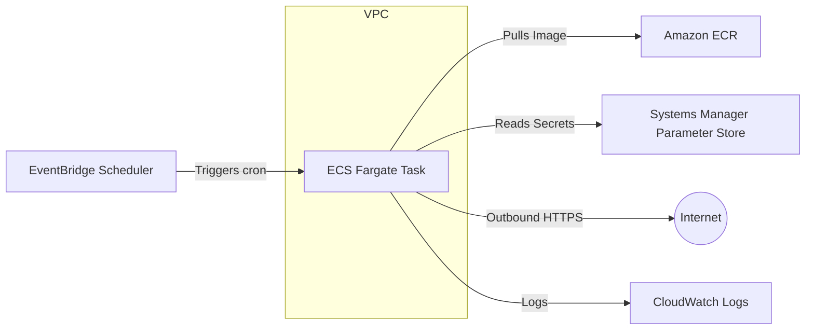

# Part 0: Architecture Overview

## Goal
Deploy `rss-morning` as a secure, automated, serverless batch job on AWS.

## The "Serverless Batch" Pattern
We are eschewing traditional servers (EC2) in favor of **AWS Fargate**.

*   **Why?** No OS patching, no server maintenance, pay only for the seconds the code runs.
*   **Cost**: For a daily job running for ~2 minutes, the cost is pennies per month.

## Architecture Diagram

## Key Components
1.  **Docker Container**: The unit of deployment.
2.  **Amazon ECR**: Where we store the Docker images (like GitHub for Docker).
3.  **AWS ECS (Fargate)**: The engine that runs the container.
4.  **EventBridge**: The alarm clock that wakes up the container.
5.  **IAM**: The ID card that gives the container permission to touch other AWS services.
